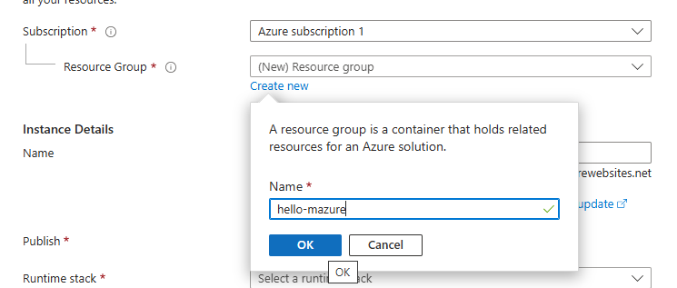

© The Chancellor, Masters and Scholars of The University of Oxford. All rights reserved.

# Explore different providers

This course is available for multiple cloud providers. Choose your preferred platform:

- [Hello Google Cloud](https://github.com/Oxford-Research-Cloud-Competency-Centre/Hello-gcloud)
- [Hello Microsoft Azure](https://github.com/Oxford-Research-Cloud-Competency-Centre/Hello-mazure)
- [Hello Amazon Web Services](https://github.com/Oxford-Research-Cloud-Competency-Centre/Hello-aws) (⭐ Most popular)
- Hello Oracle Cloud *(Coming Soon)*

*Note: Entries marked with "Coming Soon" are planned versions that are currently under development.*

# Instructions

<details>
<summary>Step 1. Fork (or make a copy of) this repository</summary>


***
</details>
<details>
<summary>Step 2. Go to the Microsoft Azure front page and type "App Services" in the search bar</summary>


***
</details>
<details>
<summary>Step 3. Go to Create -> Web App</summary>


***
</details>
<details>
<summary>Step 4. Create a new resource group for your application</summary>



***
</details>
<details>
<summary>Step 5. Choose an instance name. Select Python, Linux, and a region (UK South)</summary>


***
</details>
<details>
<summary>Step 6. Go to Deployment, set "Continuous Deployment" to "Enable" and select your repository</summary>


***
</details>
<details>
<summary>Step 7. Internet access should already be enabled. Keep it on.</summary>


***
</details>
Create the app and wait for deployment. Voilà! Access the URL.


***

# Going further

<details>
<summary><h2>Modifying the code</h2></summary>

You can commit some changes to your repository and watch how the service is updated automatically. 

</details>

<details>
<summary><h2>Cleaning up</h2></summary>

The simplest way to delete all the resources you just created is to type "Resource Groups" in the search bar and delete the group that you created earlier.


</details>

<details>
<summary><h2>Adding an API endpoint</h2></summary>

Add the following code in app.py

```	
@app.route("/hello_api")
def hello_api():
    return {
		"name": "Wrinkle Five Star",
		"species": "Duck",
		"breed": "American Pekin",
		"hatching_date": "2020-09-09",
		"sex": "Male"
    }
```

Then test your endpoint


</details>

<details>
<summary><h2>User interface</h2></summary>

Missing content

</details>

<details>
<summary><h2>Database writing/reading</h2></summary>

<details>
<summary>Go to the Azure Console and type "SQL" in the search bar</summary>
Missing content
</details>

</details>

<details>
<summary><h2>Storage bucket writing/reading</h2></summary>

<details>
<summary>Go to the Azure Console and type "Storage accounts" in the search bar</summary>
Missing content
</details>

</details>

<details>
<summary><h2>Local testing</h2></summary>

After a while, it's not fun anymore to wait for deployment. You want to test your changes before. 

<details>
<summary>Step 1. Install git and clone the repository on your local machine</summary>

```	
	git clone {repository_link}
```

***
</details>
<details>
<summary>Step 2. Install Python</summary>

```	
https://www.python.org/downloads/
```

***
</details>
<details>
<summary>Step 3. Install dependencies</summary>

```	
	 py -m pip install flask
```

***
</details>
<details>
<summary>Step 4. Run flask</summary>

```	
	 py -m flask run
```

Open localhost:5000 in your browser.  

***
</details>


</details>

<details>
<summary><h2>Running a job on a separate machine</h2></summary>

This web server is not powerful enough to handle sophisticated tasks. What if GPUs are needed for a heavy workflow? Then you need the ability to create machines dynamically and control them remotely (Infrastructure as Code). 

<details>
<summary>Install dependencies</summary>
Missing content
</details>

</details>